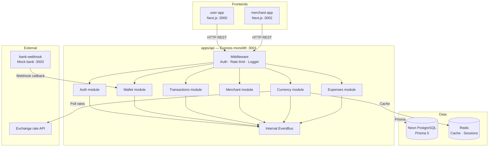
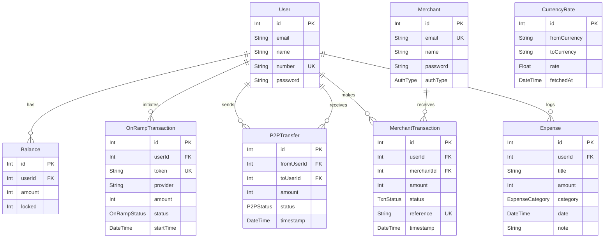

# Zenith Ledger

A full-stack digital wallet platform built as a monorepo. Supports user wallets, merchant transactions, mock bank on-ramp, live currency monitoring, and personal expense tracking.

---

## Tech stack

| Layer | Technology |
|---|---|
| Monorepo | Turborepo |
| Frontend | Next.js 16 · Tailwind CSS |
| Backend | Express.js · TypeScript |
| Auth | NextAuth v4 (credentials) |
| ORM | Prisma 5 |
| Database | Neon PostgreSQL |
| State | Recoil |
| Validation | Zod |

---

## Project structure

```
zenith_ledger/
├── apps/
│   ├── user-app/        # Next.js — user frontend (port 3000)
│   ├── merchant-app/    # Next.js — merchant frontend (port 3002)
│   ├── api/             # Express.js — all business logic (port 3001)
│   └── bank-webhook/    # Express.js — mock bank simulation
├── packages/
│   ├── db/              # Prisma client + schema (shared)
│   ├── store/           # Recoil atoms (shared frontend state)
│   ├── ui/              # Shared React components
│   ├── eslint-config/   # Shared ESLint config
│   └── typescript-config/ # Shared TypeScript config
```

---

## System architecture



---

## Database schema



---

## Enums

| Enum | Values |
|---|---|
| `OnRampStatus` | Processing · Success · Failure |
| `P2PStatus` | Processing · Completed · Failed |
| `TxnStatus` | Pending · Completed · Failed · Refunded |
| `ExpenseCategory` | Food · Transport · Bills · Shopping · Health · Entertainment · Other |
| `AuthType` | Credentials · Google · Github |

---

## API endpoints

| Method | Endpoint | Auth | Description |
|---|---|---|---|
| POST | `/api/auth/register` | No | Create user account |
| GET | `/api/wallet/balance` | Yes | Get wallet balance |
| GET | `/api/wallet/transactions` | Yes | On-ramp history |
| POST | `/api/wallet/onramp/initiate` | Yes | Start bank deposit |
| POST | `/api/wallet/onramp/success` | No | Webhook — payment success |
| POST | `/api/wallet/onramp/failure` | No | Webhook — payment failure |

_More endpoints added as modules are built._

---

## Roadmap

- [x] Monorepo setup (Turborepo)
- [x] Database schema (Prisma + Neon)
- [x] Express API foundation
- [x] Auth module (register)
- [x] Wallet module (balance, on-ramp)
- [x] NextAuth (user-app login + register)
- [x] Transactions module (P2P transfers)
- [x] Merchant module + merchant-app
- [x] Bank webhook (mock bank simulation)
- [x] Currency module (live rates)
- [x] Expenses module + calculator
- [ ] Docker Compose setup
- [x] GitHub Actions CI

---

## Architecture decision — monolith first

All business logic lives in `apps/api`. The Next.js apps are UI-only and never touch the database directly. This makes the future migration to microservices mechanical — each module folder becomes its own service, and the internal EventBus swaps to Kafka. No business logic changes.

---

## Money representation

All monetary amounts are stored as **integers in paise** (smallest currency unit, like cents). `50000` = ₹500.00. This avoids floating point precision issues entirely.